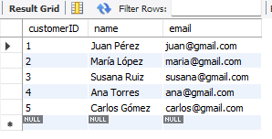

# Bloque 3. *Consultas SQL nivel básico*
_______________________________

**Instrucciones**. Utilizar la base de datos *salesbd* para construir las consultas. 
En la siguiente imagen se presenta el modelo relacional de la base de datos.
Es indispensable que primero construyas la base de datos, las tablas e insertes datos de prueba.


Nota. Sigue el ejemplo para preparar tu entregable.

Ejemplo
---------------
0. Listado de todos las tuplas de la tabla mi_tabla con la condicion_1.
   
**Solución** ✅
```sql
   SELECT *
     FROM mi_tablas
    WHERE condicion_1
```

**Salida** 📌

OPCIÓN 1. Imagen con el resultado de la consulta. 

#

OPCIÓN 2. Tabla con el resultado de la consulta.

| idTabla | atributo1 | atributo2 | atributo3 | 
| --------- | --------- | --------- | --------- |
| 5671 | Nissan | Versa | 2024 |
| 5672 | Honda| City | 2025 | 
| 5673 | Toyota | Corolla | 2026 |  
| 5674 | Honda | Civic | 2026 | 


Consultas
---------------
1. Listar todos los clientes: *Obtén el customerID, nombre y email de todos los clientes*.
   
**Solución** ✅

   TODO script SQL

**Salida** 📌

   TODO listado de atributos y tuplas
   
2. Direcciones en una ciudad específica: *Muestra todas las direcciones que estén en la ciudad de Madrid*.
   
**Solución** ✅

   TODO script SQL

**Salida** 📌

   TODO listado de atributos y tuplas
   
3. Productos con precio mayor a 200: *Lista los productos cuyo precio sea mayor a 200*.
   
**Solución** ✅

   TODO script SQL

**Salida** 📌

   TODO listado de atributos y tuplas

4. Pedidos ordenados por fecha: *Muestra todos los pedidos ordenados desde el más reciente al más antiguo*.
   
**Solución** ✅

   TODO script SQL

**Salida** 📌

   TODO listado de atributos y tuplas
   
5. Primeros 5 proveedores: *Obtén los primeros 5 proveedores ordenados alfabéticamente por nombre*.
   
**Solución** ✅

   TODO script SQL

**Salida** 📌

   TODO listado de atributos y tuplas

6. Clientes y su ciudad: *Muestra el nombre del cliente y la ciudad donde vive*.
   
**Solución** ✅

   TODO script SQL

**Salida** 📌

   TODO listado de atributos y tuplas

7. Productos y su proveedor: *Lista el nombre del producto y el nombre de su proveedor*.
   
**Solución** ✅

   TODO script SQL

**Salida** 📌

   TODO listado de atributos y tuplas

8. Pedidos de un cliente específico: *Muestra todos los pedidos realizados por el cliente con customerID = 10*.
   
**Solución** ✅

   TODO script SQL

**Salida** 📌

   TODO listado de atributos y tuplas

9. Cantidad de productos en cada pedido: *Muestra el ID del pedido y la cantidad de productos comprados en cada uno*.
   
**Solución** ✅

   TODO script SQL

**Salida** 📌

   TODO listado de atributos y tuplas

10. Clientes con dirección de envío: *Lista los clientes que tienen una dirección de tipo Shipping*.
   
**Solución** ✅

   TODO script SQL

**Salida** 📌

   TODO listado de atributos y tuplas


¿Qué practicas?
---------------
- SELECT básico
- Filtros WHRE
- Ordenamiento con ORDER BY
- Limitación de resultados son LIMIT
- JOIN simples
- Uso de claves foráneas (FK)

Llegamos al final 👌
