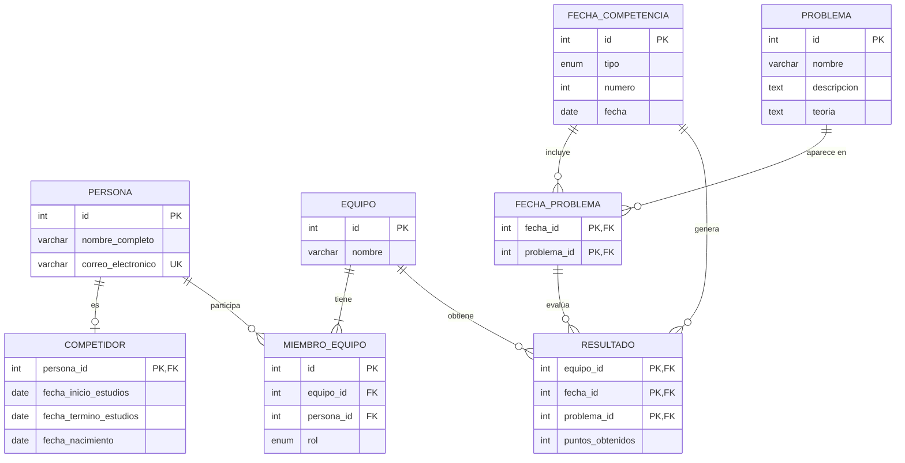

# Reporte de Práctica
## Diseño de Base de Datos Relacional y Replicación MySQL Master-Slave
> Gestión de Equipos de Competencias de Programación · Abril 2025
> Equipo: Eduardo Emmanuel Figueroa - Mario Avila Guzman

---

# Parte I: Diseño de la Base de Datos

## 1.1 Descripción del Sistema

El sistema gestiona equipos participantes en competencias de programación universitarias. El dominio se describe así:

- Cada **equipo** está conformado obligatoriamente por **3 competidores** y **1 coach**, con la posibilidad opcional de un **competidor sustituto** y un **co-coach**.
- De cada **persona** (competidor o coach) se almacena nombre completo y correo electrónico. Los competidores adicionalmente tienen fecha de inicio de estudios, fecha de término y fecha de nacimiento.
- Las **competencias** se dividen en: una **Fecha Cero** (no acumula puntaje global), tres **Fechas Clasificatorias** y una de **Repechaje** (estas sí acumulan puntaje). El cálculo del puntaje acumulado es responsabilidad de la capa de aplicación.
- Cada fecha contiene un conjunto de **problemas de programación**, cada uno con nombre, descripción y teoría opcional.
- Se registran los **puntos obtenidos** por cada equipo en cada problema de cada fecha. El ranking y puntaje global son responsabilidad de la capa de software.

> **Nota de diseño:** El cálculo del ranking (por fecha y global) y la suma de puntajes acumulados son responsabilidad de la **capa de aplicación**, no de la base de datos. La BD solo almacena los puntos individuales por equipo/fecha/problema.

---

## 1.2 Las Tres Formas Normales (3FN)

El diseño relacional sigue las Formas Normales, reglas progresivas que eliminan redundancias e inconsistencias. Se aplicaron las primeras tres:

### Primera Forma Normal (1FN)

> **Regla:** Todos los atributos deben ser atómicos (indivisibles) y cada fila debe ser única. No se permiten grupos repetitivos ni atributos multivaluados dentro de una misma columna.

**Aplicación en este diseño:**

- El rol de una persona en un equipo (`competidor`, `coach`, `sustituto`, `co_coach`) se modela como una fila separada en `MIEMBRO_EQUIPO` con un atributo `rol` (enum), en lugar de tener columnas como `competidor1`, `competidor2`, `competidor3`.
- Los problemas de cada fecha se modelan en la tabla puente `FECHA_PROBLEMA`, no como una lista dentro de `FECHA_COMPETENCIA`.
- Todos los atributos son atómicos: `nombre_completo` es un único `VARCHAR`, las fechas son tipo `DATE`, etc.

---

### Segunda Forma Normal (2FN)

> **Regla:** Cumplir 1FN y que todos los atributos no clave dependan de la **clave primaria completa** (aplica cuando la PK es compuesta).

**Aplicación en este diseño:**

- En `RESULTADO`, la PK compuesta es `(equipo_id, fecha_id, problema_id)`. El único atributo no clave es `puntos_obtenidos`, que depende de la combinación completa de los tres campos — ningún subconjunto es suficiente.
- En `FECHA_PROBLEMA`, la PK compuesta es `(fecha_id, problema_id)`. No hay atributos adicionales, por lo que no hay dependencias parciales posibles.
- En `MIEMBRO_EQUIPO`, la PK es el `id` autonumérico y todos los demás campos dependen completamente de él.

---

### Tercera Forma Normal (3FN)

> **Regla:** Cumplir 2FN y que no existan **dependencias transitivas**: ningún atributo no clave debe depender de otro atributo no clave.

**Aplicación en este diseño:**

- La separación entre `PERSONA` y `COMPETIDOR` elimina una dependencia transitiva: los datos de estudios (`fecha_inicio_estudios`, `fecha_termino_estudios`, `fecha_nacimiento`) dependen de que la persona *sea* un competidor, no de la persona directamente. Si se combinaran, un coach tendría campos en `NULL` de forma estructuralmente incorrecta.
- El `nombre` del equipo está solo en `EQUIPO`, no repetido en cada fila de `MIEMBRO_EQUIPO`. Evita que el nombre dependa transitivamente de `equipo_id` en otra tabla.
- La `descripcion` y `teoria` de un `PROBLEMA` no se repiten en `FECHA_PROBLEMA` ni en `RESULTADO` — se accede por FK, eliminando cualquier dependencia transitiva.
- El `tipo` y `numero` de cada fecha está solo en `FECHA_COMPETENCIA`, no en `RESULTADO`.

---

## 1.3 Entidades y Atributos

| Entidad | Atributos | Descripción |
|---|---|---|
| `PERSONA` | `id` PK, `nombre_completo`, `correo_electronico` UK | Representa a cualquier persona del sistema: competidores y coaches. `correo_electronico` tiene restricción `UNIQUE`. |
| `COMPETIDOR` | `persona_id` PK/FK, `fecha_inicio_estudios`, `fecha_termino_estudios` *(nullable)*, `fecha_nacimiento` | Extiende PERSONA con datos académicos. Usa `persona_id` como PK y FK simultáneamente (patrón tabla de subtipo), implementando la relación 1:0..1 con PERSONA. |
| `EQUIPO` | `id` PK, `nombre` | Unidad participante en las competencias. Sus integrantes se gestionan a través de `MIEMBRO_EQUIPO`. |
| `MIEMBRO_EQUIPO` | `id` PK, `equipo_id` FK, `persona_id` FK, `rol` enum | Tabla de unión entre EQUIPO y PERSONA. `rol` puede ser: `competidor`, `sustituto`, `coach`, `co_coach`. UK sobre `(equipo_id, persona_id)`. |
| `FECHA_COMPETENCIA` | `id` PK, `tipo` enum, `numero` *(nullable)*, `fecha` | Representa cada evento de competencia. `numero` es NULL para `fecha_cero` y `repechaje`; aplica solo a clasificatorias (1, 2, 3). |
| `PROBLEMA` | `id` PK, `nombre`, `descripcion` text, `teoria` text *(nullable)* | Problema de programación. El campo `teoria` es opcional. |
| `FECHA_PROBLEMA` | `fecha_id` PK/FK, `problema_id` PK/FK | Tabla puente que asocia qué problemas aparecen en qué fecha. Clave primaria compuesta. |
| `RESULTADO` | `equipo_id` PK/FK, `fecha_id` PK/FK, `problema_id` PK/FK, `puntos_obtenidos` | Registra los puntos de un equipo en un problema de una fecha. FK compuesta a `FECHA_PROBLEMA` garantiza que solo se registren resultados de problemas asignados a esa fecha. |

---

## 1.4 Diagrama Entidad-Relación



### Relaciones

| Relación | Cardinalidad | Descripción |
|---|:---:|---|
| `PERSONA` → `COMPETIDOR` | 1 a 0..1 | Una persona puede ser opcionalmente un competidor (patrón subtipo con PK compartida) |
| `PERSONA` → `MIEMBRO_EQUIPO` | 1 a N | Una persona puede pertenecer a múltiples equipos con distintos roles |
| `EQUIPO` → `MIEMBRO_EQUIPO` | 1 a 1..N | Un equipo tiene al menos un miembro |
| `FECHA_COMPETENCIA` → `FECHA_PROBLEMA` | 1 a N | Una fecha incluye varios problemas |
| `PROBLEMA` → `FECHA_PROBLEMA` | 1 a N | Un problema puede aparecer en múltiples fechas |
| `RESULTADO` → `FECHA_PROBLEMA` | N a 1 | Cada resultado referencia un par problema-fecha válido (FK compuesta) |
| `EQUIPO` → `RESULTADO` | 1 a N | Un equipo obtiene múltiples resultados a lo largo de las fechas |

---

## 1.5 Decisiones de Diseño Destacadas

- **Responsabilidad en capa de aplicación:** El cálculo del puntaje global acumulado, el ranking por fecha y el ranking general se delegan intencionalmente a la capa de software. La BD solo almacena los puntos individuales.
- **Integridad referencial compuesta:** `RESULTADO` tiene una FK compuesta a `FECHA_PROBLEMA(fecha_id, problema_id)`, garantizando a nivel de motor que no se puede registrar un resultado para un problema que no esté asignado a esa fecha.
- **Subtipo con PK compartida:** `COMPETIDOR` hereda de `PERSONA` usando su `persona_id` como PK y FK simultáneamente. Esto evita duplicar campos de contacto y permite que los coaches sean personas sin datos de estudiante.
- **Campos opcionales con NULL:** `fecha_termino_estudios` en `COMPETIDOR` y `teoria` en `PROBLEMA` son nullable, reflejando datos que no siempre existen.

---

# Parte II: Replicación MySQL Master-Slave

## 2.1 ¿Qué es la Replicación?

La replicación en MySQL es un mecanismo que permite copiar y mantener sincronizados los datos de un servidor (**Master** o Source) hacia uno o más servidores secundarios (**Slave** o Replica), de manera automática y continua.

En el esquema **Master-Slave unidireccional**, el flujo de datos es siempre del Master al Slave:

```
Aplicación
    │
    ├── Escrituras (INSERT/UPDATE/DELETE) ──► MASTER
    │                                            │
    └── Lecturas (SELECT) ────────────────► SLAVE (réplica)
```

El Master es el servidor donde se realizan todas las operaciones de escritura. El Slave mantiene una copia idéntica que puede usarse para lectura, respaldo o contingencia.

---

## 2.2 Mecanismo de Funcionamiento

La replicación opera mediante tres componentes:

```
MASTER                              SLAVE
──────                              ─────
Operaciones                         
de escritura                        
    │                               
    ▼                               
┌─────────────┐    eventos      ┌─────────────┐
│ Binary Log  │ ──────────────► │  Relay Log  │
│ (MARIOAG-   │   I/O Thread    │  (local)    │
│  bin.XXXXX) │                 └──────┬──────┘
└─────────────┘                        │
                                  SQL Thread
                                        │
                                        ▼
                                  Base de datos
                                  replicada ✓
```

| Componente | Rol | Descripción |
|---|---|---|
| **Binary Log** (Master) | Fuente de verdad | Registra cada operación de escritura (DDL y DML) con nombre de archivo y posición numérica. |
| **I/O Thread** (Slave) | Lector | Se conecta al Master, lee eventos desde la última posición conocida y los guarda en el Relay Log local. |
| **SQL Thread** (Slave) | Ejecutor | Lee el Relay Log y reproduce cada evento en la BD local del Slave, en el mismo orden que ocurrieron en el Master. |

---

## 2.3 Entorno Configurado

| | Master | Slave |
|---|---|---|
| **Sistema Operativo** | Windows 10/11 | Ubuntu Linux 24.04 |
| **Versión MySQL** | 8.0.40 | 8.0.45 |
| **IP (Tailscale VPN)** | `100.110.30.15` | `100.111.63.7` |
| **`server-id`** | `1` | `2` |
| **Binary Log** | `MARIOAG-bin` | No aplica |
| **Base de datos** | `competencias_programacion` | `competencias_programacion` |

> La conectividad entre ambas máquinas se realiza a través de **Tailscale**, una red VPN mesh que asigna IPs en el rango `100.x.x.x`, permitiendo comunicación directa entre equipos independientemente de su red física local.

---

## 2.4 Configuración del Master (Windows — `my.ini`)

**Ruta:** `C:\ProgramData\MySQL\MySQL Server 8.0\my.ini`

```ini
[mysqld]
server-id           = 1                          # ID único del servidor
log_bin             = mysql-bin                  # Activa Binary Log
bind-address        = 0.0.0.0                    # Acepta conexiones externas
binlog-do-db        = competencias_programacion  # Solo replicar esta BD
```

| Parámetro | Valor | Descripción |
|---|---|---|
| `server-id` | `1` | Identificador único del servidor en la topología. Cada servidor debe tener un valor distinto. |
| `log_bin` | `mysql-bin` | Habilita el Binary Log. Los archivos quedan nombrados `MARIOAG-bin.000XXX`. Esencial para la replicación. |
| `bind-address` | `0.0.0.0` | Permite que el servidor acepte conexiones desde cualquier IP, necesario para que el Slave se conecte remotamente. |
| `binlog-do-db` | `competencias_programacion` | Filtra el Binary Log para incluir solo eventos de esta BD, reduciendo el tráfico de replicación. |

---

## 2.5 Configuración del Slave (Linux — `mysqld.cnf`)

**Ruta:** `/etc/mysql/mysql.conf.d/mysqld.cnf`

```ini
[mysqld]
server-id           = 2                          # ID único, diferente al Master
replicate-do-db     = competencias_programacion  # Solo replicar esta BD
bind-address        = 127.0.0.1                  # Slave solo acepta conexiones locales
```

| Parámetro | Valor | Descripción |
|---|---|---|
| `server-id` | `2` | Debe ser diferente al del Master. Cualquier valor entre 2 y 2³²-1 es válido. |
| `replicate-do-db` | `competencias_programacion` | Indica al Slave que solo aplique eventos de replicación de esta base de datos. |
| `bind-address` | `127.0.0.1` | El Slave no necesita aceptar conexiones externas (solo inicia conexiones hacia el Master), por lo que se limita a localhost. |

---

## 2.6 Creación del Usuario de Replicación

En el Master se configuró un usuario dedicado exclusivamente a la replicación, siguiendo el principio de **mínimo privilegio**:

```sql
-- Ejecutado en el MASTER
ALTER USER 'usuario_replica'@'%'
  IDENTIFIED WITH mysql_native_password BY 'Repl@2024';

ALTER USER 'usuario_replica'@'100.111.63.7'
  IDENTIFIED WITH mysql_native_password BY 'Repl@2024';

GRANT REPLICATION SLAVE ON *.* TO 'usuario_replica'@'%';
GRANT REPLICATION SLAVE ON *.* TO 'usuario_replica'@'100.111.63.7';

FLUSH PRIVILEGES;
```

> **Nota:** Se utilizó `mysql_native_password` en lugar del predeterminado `caching_sha2_password` de MySQL 8.0. Esto es recomendable cuando no se configura SSL/TLS en la conexión de replicación, ya que `caching_sha2_password` requiere cifrado o intercambio de clave pública RSA.

---

## 2.7 Configuración de la Replicación en el Slave

Primero se obtuvo la posición actual del Binary Log en el Master:

```sql
-- Ejecutado en el MASTER
SHOW MASTER STATUS;
```

```
+--------------------+----------+---------------------------+
| File               | Position | Binlog_Do_DB              |
+--------------------+----------+---------------------------+
| MARIOAG-bin.000409 |     1546 | competencias_programacion |
+--------------------+----------+---------------------------+
```

Con esa información se configuró el Slave vía SSH:

```sql
-- Ejecutado en el SLAVE
STOP SLAVE;

CHANGE MASTER TO
  MASTER_HOST          = '100.110.30.15',
  MASTER_USER          = 'usuario_replica',
  MASTER_PASSWORD      = 'Repl@2024',
  MASTER_PORT          = 3306,
  MASTER_LOG_FILE      = 'MARIOAG-bin.000409',
  MASTER_LOG_POS       = 1546,
  MASTER_CONNECT_RETRY = 10,
  GET_MASTER_PUBLIC_KEY = 1;

START SLAVE;
```

| Parámetro | Valor | Función |
|---|---|---|
| `MASTER_HOST` | `100.110.30.15` | IP Tailscale donde el Slave debe conectarse. |
| `MASTER_LOG_FILE` | `MARIOAG-bin.000409` | Nombre exacto del archivo Binary Log desde donde iniciar la replicación. |
| `MASTER_LOG_POS` | `1546` | Posición byte exacta en el Binary Log. Debe corresponder a un punto de consistencia. |
| `MASTER_CONNECT_RETRY` | `10` | Segundos de espera antes de reintentar conexión si el Master no responde. |
| `GET_MASTER_PUBLIC_KEY` | `1` | Obtiene la clave pública RSA del Master para autenticación segura. |

---

## 2.8 Verificación de la Replicación

```sql
-- Ejecutado en el SLAVE
SHOW SLAVE STATUS\G
```

```
Slave_IO_Running:       Yes        ← Hilo I/O conectado al Master ✓
Slave_SQL_Running:      Yes        ← Hilo SQL aplicando eventos   ✓
Last_IO_Errno:          0          ← Sin errores de conexión       ✓
Last_SQL_Errno:         0          ← Sin errores SQL               ✓
Seconds_Behind_Master:  0          ← Slave sincronizado            ✓
Master_Host:            100.110.30.15
Master_User:            usuario_replica
Master_Log_File:        MARIOAG-bin.000409
```

### Prueba funcional

Se realizó una prueba de extremo a extremo para confirmar la replicación en tiempo real:

```sql
-- MASTER: insertar registro de prueba
USE competencias_programacion;
CREATE TABLE _repl_test (id INT PRIMARY KEY, msg VARCHAR(50));
INSERT INTO _repl_test VALUES (1, 'test_replicacion_OK');

-- SLAVE: verificar que llegó
USE competencias_programacion;
SELECT * FROM _repl_test;
-- ✓ Resultado: id=1, msg='test_replicacion_OK'

-- MASTER: limpiar (también se replica)
DROP TABLE _repl_test;
```

---

## 2.9 Beneficios

- **Alta disponibilidad para lectura:** Las consultas de solo lectura (reportes, búsquedas, generación de rankings) pueden redirigirse al Slave, reduciendo la carga del Master.
- **Respaldo en caliente (Hot Backup):** El Slave contiene una copia actualizada de los datos sin necesidad de detener el servicio. Se puede hacer un `mysqldump` del Slave sin interrumpir operaciones del Master.
- **Recuperación ante desastres:** Si el Master falla, el Slave puede ser promovido a Master manualmente en pocos minutos, minimizando el tiempo de inactividad.
- **Separación de cargas:** Permite distribuir la carga entre escrituras (Master) y lecturas (Slave), mejorando el rendimiento general del sistema.
- **Escalabilidad horizontal:** Se pueden agregar múltiples Slaves a un solo Master para distribuir aún más la carga de lectura.

---

## 2.10 Limitantes y Consideraciones

- **Replicación unidireccional:** Los cambios solo van del Master al Slave. Las escrituras directas en el Slave no se replican al Master y pueden generar inconsistencias graves.
- **Sin failover automático:** Si el Master cae, el tráfico no se redirige automáticamente al Slave. Se requiere intervención manual o herramientas adicionales (Orchestrator, ProxySQL, InnoDB Cluster).
- **Replication lag:** Bajo alta carga de escritura, el Slave puede retrasarse (`Seconds_Behind_Master > 0`), sirviendo datos desactualizados temporalmente.
- **Posición del Binary Log crítica:** Configurar `MASTER_LOG_POS` incorrectamente puede causar pérdida o duplicación de datos. Debe obtenerse en un punto de consistencia.
- **El Slave no es de solo lectura por defecto:** Sin configurar `read_only = ON` en el Slave, cualquier usuario con permisos puede escribir directamente, rompiendo la consistencia.

---

## 2.11 Escenarios y Consecuencias

| Escenario | ¿Qué ocurre? | Acción recomendada |
|---|---|---|
| **El Master se cae** | El Slave deja de recibir eventos. `Slave_IO_Running` pasa a `Connecting`. Los datos en el Slave son los del último evento replicado. La aplicación falla si apunta al Master. | Promover el Slave a Master: `STOP SLAVE; RESET MASTER;` y reapuntar la aplicación. |
| **Se escribe directo en el Slave** | El dato existe solo en el Slave. Si el Master replica un evento conflictivo (mismo PK), el SQL Thread falla con *duplicate key* y la replicación se detiene. | `SET GLOBAL SQL_SLAVE_SKIP_COUNTER=1; START SLAVE;` con precaución. Configurar `read_only = ON` para prevenir. |
| **La red (Tailscale) se interrumpe** | El hilo I/O entra en `Connecting` y reintenta cada `MASTER_CONNECT_RETRY` segundos. El SQL Thread sigue aplicando eventos del Relay Log existente. Sin pérdida de datos. | Al restaurarse la conexión, el Slave retoma automáticamente desde la última posición en `mysql.slave_master_info`. |
| **El Slave se reinicia** | MySQL lee la configuración de replicación desde `mysql.slave_master_info` y reanuda automáticamente desde el último punto procesado. | Ninguna intervención necesaria si la configuración es correcta. |
| **Se necesita un backup** | Se puede hacer `mysqldump` del Slave sin afectar el Master. El Slave continúa recibiendo eventos en paralelo. | `mysqldump --single-transaction` en el Slave es suficiente. Para backups point-in-time, combinar con el Binary Log del Master. |

---

# Conclusiones

El diseño de la base de datos `competencias_programacion` demuestra la correcta aplicación de las tres primeras formas normales, resultando en un esquema sin redundancias, con integridad referencial sólida y con una clara separación de responsabilidades entre la base de datos y la capa de aplicación.

La implementación de replicación Master-Slave entre un servidor Windows (Master) y un servidor Linux Ubuntu (Slave) a través de la red VPN Tailscale demostró ser funcional y robusta. La replicación asíncrona de MySQL 8.0 garantizó la propagación correcta de todos los eventos DDL y DML a la réplica en tiempo real, verificada tanto mediante `SHOW SLAVE STATUS` como con pruebas de inserción directa.

La configuración realizada provee una base sólida de alta disponibilidad para lectura y recuperación ante desastres. Para un entorno de producción de alta criticidad se recomienda complementarla con herramientas de failover automático como **MySQL InnoDB Cluster** u **Orchestrator**.
