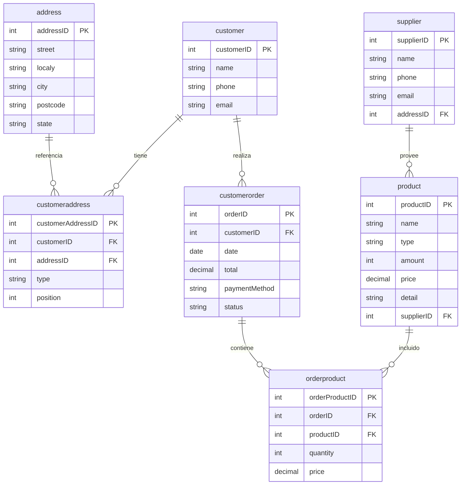

# Reporte de Práctica: Fragmentación Híbrida (Horizontal + Réplicas) de salesDB

## Universidad Autónoma del Estado de Hidalgo
### Base de Datos Distribuidas

---

## 1. Objetivo

Implementar una fragmentación híbrida de la base de datos `salesDB` combinando:
- **Fragmentación Horizontal**: Distribución de datos por ubicación geográfica (estado)
- **Réplicas**: Tablas completas replicadas en cada fragmento para mantener integridad referencial

---

## 2. Estrategia de Fragmentación

### 2.1 Criterio de Fragmentación Horizontal

La fragmentación se realiza basándose en el campo `state` de la tabla `address`:

| Fragmento | Estados Incluidos | Descripción |
|-----------|-------------------|-------------|
| **ZonaDB_1** | CDMX, Hidalgo | Zona Centro |
| **ZonaDB_2** | Queretaro, Puebla | Zona Centro-Sur |
| **ZonaDB_3** | Veracruz, Morelos | Zona Sur |

### 2.2 Tablas Fragmentadas vs Réplicas

| Tabla | Tipo | Justificación |
|-------|------|---------------|
| `address` | Fragmentada | Cada dirección pertenece a un estado específico |
| `customer` | Fragmentada | Cada cliente tiene dirección en una zona específica |
| `customeraddress` | Fragmentada | Relación entre cliente y dirección específica |
| `customerorder` | Fragmentada | Órdenes pertenecen a clientes de zonas específicas |
| `orderproduct` | Fragmentada | Productos en órdenes de zonas específicas |
| `supplier` | **RÉPLICA** | Proveedores necesarios en todos los fragmentos para FK de product |
| `product` | **RÉPLICA** | Productos necesarios en todos los fragmentos para completar órdenes |

---

## 3. Modelo Relacional Original



---

## 4. Scripts de Fragmentación Híbrida

### 4.1 Paso 1: Crear ZonaDB_1 (CDMX + Hidalgo)

```sql
-- Crear base de datos
DROP DATABASE IF EXISTS ZonaDB_1;
CREATE DATABASE ZonaDB_1 CHARACTER SET utf8 COLLATE utf8_general_ci;
USE ZonaDB_1;

-- Tabla address (FRAGMENTADA - solo CDMX e Hidalgo)
CREATE TABLE address (
    addressID INT NOT NULL,
    street VARCHAR(100),
    localy VARCHAR(50),
    city VARCHAR(50),
    postcode VARCHAR(10),
    state VARCHAR(50),
    PRIMARY KEY (addressID)
) ENGINE=InnoDB;

-- Tabla customer (FRAGMENTADA)
CREATE TABLE customer (
    customerID INT NOT NULL,
    name VARCHAR(100),
    phone VARCHAR(20),
    email VARCHAR(100),
    PRIMARY KEY (customerID)
) ENGINE=InnoDB;

-- Tabla customerAddress (FRAGMENTADA)
CREATE TABLE customerAddress (
    customerAddressID INT NOT NULL,
    customerID INT,
    addressID INT,
    type VARCHAR(50),
    position INT,
    PRIMARY KEY (customerAddressID),
    FOREIGN KEY (customerID) REFERENCES customer(customerID),
    FOREIGN KEY (addressID) REFERENCES address(addressID)
) ENGINE=InnoDB;

-- Tabla supplier (RÉPLICA - completa)
CREATE TABLE supplier (
    supplierID INT NOT NULL,
    name VARCHAR(100),
    phone VARCHAR(20),
    email VARCHAR(100),
    addressID INT,
    PRIMARY KEY (supplierID)
) ENGINE=InnoDB;

-- Tabla product (RÉPLICA - completa)
CREATE TABLE product (
    productID INT NOT NULL,
    name VARCHAR(100),
    type VARCHAR(50),
    amount INT,
    price DECIMAL(10,2),
    detail TEXT,
    supplierID INT,
    PRIMARY KEY (productID),
    FOREIGN KEY (supplierID) REFERENCES supplier(supplierID)
) ENGINE=InnoDB;

-- Tabla customerOrder (FRAGMENTADA)
CREATE TABLE customerOrder (
    orderID INT NOT NULL,
    customerID INT,
    date DATE,
    total DECIMAL(10,2),
    paymentMethod VARCHAR(50),
    status VARCHAR(50),
    PRIMARY KEY (orderID),
    FOREIGN KEY (customerID) REFERENCES customer(customerID)
) ENGINE=InnoDB;

-- Tabla orderProduct (FRAGMENTADA)
CREATE TABLE orderProduct (
    orderProductID INT NOT NULL,
    orderID INT,
    productID INT,
    quantity INT,
    price DECIMAL(10,2),
    PRIMARY KEY (orderProductID),
    FOREIGN KEY (orderID) REFERENCES customerOrder(orderID),
    FOREIGN KEY (productID) REFERENCES product(productID)
) ENGINE=InnoDB;

-- CARGAR DATOS
-- Addresses de CDMX e Hidalgo
INSERT INTO ZonaDB_1.address 
SELECT * FROM salesDB.address WHERE state IN ('CDMX','Hidalgo');

-- Customers con dirección en CDMX o Hidalgo
INSERT INTO ZonaDB_1.customer (customerID, name, phone, email) 
SELECT DISTINCT c.customerID, c.name, c.phone, c.email 
FROM salesDB.customer c
JOIN salesDB.customeraddress ca ON c.customerID = ca.customerID
JOIN salesDB.address a ON ca.addressID = a.addressID
WHERE a.state IN ('CDMX','Hidalgo');

-- CustomerAddress filtrado
INSERT INTO ZonaDB_1.customerAddress 
SELECT ca.* FROM salesDB.customeraddress ca
JOIN salesDB.address a ON ca.addressID = a.addressID
WHERE a.state IN ('CDMX','Hidalgo');

-- RÉPLICAS completas
INSERT INTO ZonaDB_1.supplier SELECT * FROM salesDB.supplier;
INSERT INTO ZonaDB_1.product SELECT * FROM salesDB.product;

-- CustomerOrder filtrado
INSERT INTO ZonaDB_1.customerOrder
SELECT DISTINCT co.* FROM salesDB.customerorder co
JOIN salesDB.customer c ON co.customerID = c.customerID
JOIN salesDB.customeraddress ca ON c.customerID = ca.customerID
JOIN salesDB.address a ON ca.addressID = a.addressID
WHERE a.state IN ('CDMX','Hidalgo');

-- OrderProduct filtrado
INSERT INTO ZonaDB_1.orderProduct
SELECT DISTINCT op.* FROM salesDB.orderproduct op
JOIN salesDB.customerorder co ON op.orderID = co.orderID
JOIN salesDB.customer c ON co.customerID = c.customerID
JOIN salesDB.customeraddress ca ON c.customerID = ca.customerID
JOIN salesDB.address a ON ca.addressID = a.addressID
WHERE a.state IN ('CDMX','Hidalgo');
```

### 4.2 Paso 2: Crear ZonaDB_2 (Queretaro + Puebla)

```sql
-- Crear base de datos
DROP DATABASE IF EXISTS ZonaDB_2;
CREATE DATABASE ZonaDB_2 CHARACTER SET utf8 COLLATE utf8_general_ci;
USE ZonaDB_2;

-- Crear tablas (misma estructura que ZonaDB_1)
CREATE TABLE address (addressID INT NOT NULL, street VARCHAR(100), localy VARCHAR(50), city VARCHAR(50), postcode VARCHAR(10), state VARCHAR(50), PRIMARY KEY (addressID)) ENGINE=InnoDB;
CREATE TABLE customer (customerID INT NOT NULL, name VARCHAR(100), phone VARCHAR(20), email VARCHAR(100), PRIMARY KEY (customerID)) ENGINE=InnoDB;
CREATE TABLE customerAddress (customerAddressID INT NOT NULL, customerID INT, addressID INT, type VARCHAR(50), position INT, PRIMARY KEY (customerAddressID), FOREIGN KEY (customerID) REFERENCES customer(customerID), FOREIGN KEY (addressID) REFERENCES address(addressID)) ENGINE=InnoDB;
CREATE TABLE supplier (supplierID INT NOT NULL, name VARCHAR(100), phone VARCHAR(20), email VARCHAR(100), addressID INT, PRIMARY KEY (supplierID)) ENGINE=InnoDB;
CREATE TABLE product (productID INT NOT NULL, name VARCHAR(100), type VARCHAR(50), amount INT, price DECIMAL(10,2), detail TEXT, supplierID INT, PRIMARY KEY (productID), FOREIGN KEY (supplierID) REFERENCES supplier(supplierID)) ENGINE=InnoDB;
CREATE TABLE customerOrder (orderID INT NOT NULL, customerID INT, date DATE, total DECIMAL(10,2), paymentMethod VARCHAR(50), status VARCHAR(50), PRIMARY KEY (orderID), FOREIGN KEY (customerID) REFERENCES customer(customerID)) ENGINE=InnoDB;
CREATE TABLE orderProduct (orderProductID INT NOT NULL, orderID INT, productID INT, quantity INT, price DECIMAL(10,2), PRIMARY KEY (orderProductID), FOREIGN KEY (orderID) REFERENCES customerOrder(orderID), FOREIGN KEY (productID) REFERENCES product(productID)) ENGINE=InnoDB;

-- CARGAR DATOS (Queretaro + Puebla)
INSERT INTO ZonaDB_2.address SELECT * FROM salesDB.address WHERE state IN ('Queretaro','Puebla');
INSERT INTO ZonaDB_2.customer (customerID, name, phone, email) SELECT DISTINCT c.customerID, c.name, c.phone, c.email FROM salesDB.customer c JOIN salesDB.customeraddress ca ON c.customerID = ca.customerID JOIN salesDB.address a ON ca.addressID = a.addressID WHERE a.state IN ('Queretaro','Puebla');
INSERT INTO ZonaDB_2.customerAddress SELECT ca.* FROM salesDB.customeraddress ca JOIN salesDB.address a ON ca.addressID = a.addressID WHERE a.state IN ('Queretaro','Puebla');
INSERT INTO ZonaDB_2.supplier SELECT * FROM salesDB.supplier;
INSERT INTO ZonaDB_2.product SELECT * FROM salesDB.product;
INSERT INTO ZonaDB_2.customerOrder SELECT DISTINCT co.* FROM salesDB.customerorder co JOIN salesDB.customer c ON co.customerID = c.customerID JOIN salesDB.customeraddress ca ON c.customerID = ca.customerID JOIN salesDB.address a ON ca.addressID = a.addressID WHERE a.state IN ('Queretaro','Puebla');
INSERT INTO ZonaDB_2.orderProduct SELECT DISTINCT op.* FROM salesDB.orderproduct op JOIN salesDB.customerorder co ON op.orderID = co.orderID JOIN salesDB.customer c ON co.customerID = c.customerID JOIN salesDB.customeraddress ca ON c.customerID = ca.customerID JOIN salesDB.address a ON ca.addressID = a.addressID WHERE a.state IN ('Queretaro','Puebla');
```

### 4.3 Paso 3: Crear ZonaDB_3 (Veracruz + Morelos)

```sql
-- Crear base de datos
DROP DATABASE IF EXISTS ZonaDB_3;
CREATE DATABASE ZonaDB_3 CHARACTER SET utf8 COLLATE utf8_general_ci;
USE ZonaDB_3;

-- Crear tablas (misma estructura)
CREATE TABLE address (addressID INT NOT NULL, street VARCHAR(100), localy VARCHAR(50), city VARCHAR(50), postcode VARCHAR(10), state VARCHAR(50), PRIMARY KEY (addressID)) ENGINE=InnoDB;
CREATE TABLE customer (customerID INT NOT NULL, name VARCHAR(100), phone VARCHAR(20), email VARCHAR(100), PRIMARY KEY (customerID)) ENGINE=InnoDB;
CREATE TABLE customerAddress (customerAddressID INT NOT NULL, customerID INT, addressID INT, type VARCHAR(50), position INT, PRIMARY KEY (customerAddressID), FOREIGN KEY (customerID) REFERENCES customer(customerID), FOREIGN KEY (addressID) REFERENCES address(addressID)) ENGINE=InnoDB;
CREATE TABLE supplier (supplierID INT NOT NULL, name VARCHAR(100), phone VARCHAR(20), email VARCHAR(100), addressID INT, PRIMARY KEY (supplierID)) ENGINE=InnoDB;
CREATE TABLE product (productID INT NOT NULL, name VARCHAR(100), type VARCHAR(50), amount INT, price DECIMAL(10,2), detail TEXT, supplierID INT, PRIMARY KEY (productID), FOREIGN KEY (supplierID) REFERENCES supplier(supplierID)) ENGINE=InnoDB;
CREATE TABLE customerOrder (orderID INT NOT NULL, customerID INT, date DATE, total DECIMAL(10,2), paymentMethod VARCHAR(50), status VARCHAR(50), PRIMARY KEY (orderID), FOREIGN KEY (customerID) REFERENCES customer(customerID)) ENGINE=InnoDB;
CREATE TABLE orderProduct (orderProductID INT NOT NULL, orderID INT, productID INT, quantity INT, price DECIMAL(10,2), PRIMARY KEY (orderProductID), FOREIGN KEY (orderID) REFERENCES customerOrder(orderID), FOREIGN KEY (productID) REFERENCES product(productID)) ENGINE=InnoDB;

-- CARGAR DATOS (Veracruz + Morelos)
INSERT INTO ZonaDB_3.address SELECT * FROM salesDB.address WHERE state IN ('Veracruz','Morelos');
INSERT INTO ZonaDB_3.customer (customerID, name, phone, email) SELECT DISTINCT c.customerID, c.name, c.phone, c.email FROM salesDB.customer c JOIN salesDB.customeraddress ca ON c.customerID = ca.customerID JOIN salesDB.address a ON ca.addressID = a.addressID WHERE a.state IN ('Veracruz','Morelos');
INSERT INTO ZonaDB_3.customerAddress SELECT ca.* FROM salesDB.customeraddress ca JOIN salesDB.address a ON ca.addressID = a.addressID WHERE a.state IN ('Veracruz','Morelos');
INSERT INTO ZonaDB_3.supplier SELECT * FROM salesDB.supplier;
INSERT INTO ZonaDB_3.product SELECT * FROM salesDB.product;
INSERT INTO ZonaDB_3.customerOrder SELECT DISTINCT co.* FROM salesDB.customerorder co JOIN salesDB.customer c ON co.customerID = c.customerID JOIN salesDB.customeraddress ca ON c.customerID = ca.customerID JOIN salesDB.address a ON ca.addressID = a.addressID WHERE a.state IN ('Veracruz','Morelos');
INSERT INTO ZonaDB_3.orderProduct SELECT DISTINCT op.* FROM salesDB.orderproduct op JOIN salesDB.customerorder co ON op.orderID = co.orderID JOIN salesDB.customer c ON co.customerID = c.customerID JOIN salesDB.customeraddress ca ON c.customerID = ca.customerID JOIN salesDB.address a ON ca.addressID = a.addressID WHERE a.state IN ('Veracruz','Morelos');
```

---

## 5. Modelos Relacionales de los Fragmentos

### 5.1 Fragmento ZonaDB_1 (CDMX + Hidalgo)


---

## 6. Estadísticas de Fragmentación

### 6.1 Distribución por Zonas Geográficas

| Fragmento | Estados | Addresses | Customers | CustomerOrders |
|-----------|---------|-----------|-----------|----------------|
| **ZonaDB_1** | CDMX, Hidalgo | 30 | 34 | 35 |
| **ZonaDB_2** | Queretaro, Puebla | 45 | 48 | 48 |
| **ZonaDB_3** | Veracruz, Morelos | 25 | 26 | 26 |
| **Total** | - | 100 | 108* | 109* |
| **salesDB Original** | - | 100 | 100 | 101 |

\* El total es mayor debido a que 8 customers tienen múltiples direcciones en diferentes estados.

### 6.2 RÉPLICAS en Cada Fragmento

| Tabla | ZonaDB_1 | ZonaDB_2 | ZonaDB_3 | Justificación |
|-------|----------|----------|----------|---------------|
| supplier | 100 | 100 | 100 | Necesaria para FK de product |
| product | 100 | 100 | 100 | Necesaria para completar órdenes |

### 6.3 Clientes con Múltiples Direcciones

Los siguientes clientes aparecen en más de un fragmento porque tienen direcciones en diferentes estados:

| CustomerID | Nombre | Estados |
|------------|--------|---------|
| 38 | Luis Sanchez | Hidalgo, Queretaro |
| 39 | Carlos Sanchez | Puebla, Veracruz |
| 40 | Lucia Flores | CDMX, Puebla |
| 41 | Juan Torres | Queretaro, Veracruz |
| 42 | Maria Perez | Puebla, Queretaro |
| 43 | Carlos Torres | CDMX, Puebla |
| 44 | Juan Martinez | CDMX, Queretaro |
| 46 | Lucia Ramirez | Hidalgo, Queretaro |
| 47 | Ana Flores | Morelos, Queretaro |

---

## 7. Verificación de Integridad

### 7.1 Consulta de Verificación

```sql
-- Verificar distribución de customers
SELECT 'ZonaDB_1 (CDMX + Hidalgo)' as fragmento, COUNT(*) as customers 
FROM ZonaDB_1.customer
UNION ALL
SELECT 'ZonaDB_2 (Queretaro + Puebla)', COUNT(*) 
FROM ZonaDB_2.customer
UNION ALL
SELECT 'ZonaDB_3 (Veracruz + Morelos)', COUNT(*) 
FROM ZonaDB_3.customer
UNION ALL
SELECT 'salesDB (original)', COUNT(*) 
FROM salesDB.customer;
```

### 7.2 Resultados de Verificación

| Base de Datos | Customers | Suppliers | Products | Orders |
|---------------|-----------|-----------|----------|--------|
| salesDB | 100 | 100 | 100 | 101 |
| ZonaDB_1 | 34 | 100 | 100 | 35 |
| ZonaDB_2 | 48 | 100 | 100 | 48 |
| ZonaDB_3 | 26 | 100 | 100 | 26 |

---

## 8. Visualización de la Fragmentación

```
Base Original (salesDB)
├── address (100 registros) - Distribuidos por estado
├── customer (100 registros)
├── customeraddress (110 registros)
├── customerorder (101 registros)
├── orderproduct (100 registros)
├── product (100 registros) - REPLICADO
└── supplier (100 registros) - REPLICADO

Fragmentación Híbrida:

┌─────────────────────────────────────────────────────────────┐
│  ZonaDB_1: CDMX + Hidalgo                                   │
├─────────────────────────────────────────────────────────────┤
│  address: 30 registros (solo CDMX, Hidalgo)                │
│  customer: 34 registros                                     │
│  customeraddress: 35 registros                              │
│  customerorder: 35 registros                                │
│  orderproduct: 34 registros                                 │
│  ★ supplier: 100 registros (RÉPLICA)                       │
│  ★ product: 100 registros (RÉPLICA)                        │
└─────────────────────────────────────────────────────────────┘

┌─────────────────────────────────────────────────────────────┐
│  ZonaDB_2: Queretaro + Puebla                               │
├─────────────────────────────────────────────────────────────┤
│  address: 45 registros (solo Queretaro, Puebla)            │
│  customer: 48 registros                                     │
│  customeraddress: 48 registros                              │
│  customerorder: 48 registros                                │
│  orderproduct: 48 registros                                 │
│  ★ supplier: 100 registros (RÉPLICA)                       │
│  ★ product: 100 registros (RÉPLICA)                        │
└─────────────────────────────────────────────────────────────┘

┌─────────────────────────────────────────────────────────────┐
│  ZonaDB_3: Veracruz + Morelos                               │
├─────────────────────────────────────────────────────────────┤
│  address: 25 registros (solo Veracruz, Morelos)            │
│  customer: 26 registros                                     │
│  customeraddress: 26 registros                              │
│  customerorder: 26 registros                                │
│  orderproduct: 26 registros                                 │
│  ★ supplier: 100 registros (RÉPLICA)                       │
│  ★ product: 100 registros (RÉPLICA)                        │
└─────────────────────────────────────────────────────────────┘
```

---

## 9. Conclusiones

1. **Fragmentación Híbrida Exitosa**: Se implementó una fragmentación que combina la distribución horizontal por ubicación geográfica con réplicas de tablas necesarias para mantener la integridad referencial.

2. **Cobertura Completa**: Los tres fragmentos cubren todos los estados presentes en la base de datos original (CDMX, Hidalgo, Queretaro, Puebla, Veracruz, Morelos).

3. **Réplicas Necesarias**: Las tablas `supplier` y `product` se replican en todos los fragmentos porque:
   - `product` tiene una FK a `supplier` que debe resolverse localmente
   - Las órdenes de cada zona necesitan información de productos completos

4. **Overlapping Permitido**: Algunos customers aparecen en múltiples fragmentos cuando tienen direcciones en diferentes estados. Esto es correcto en fragmentación horizontal y permite reconstruir la base original sin pérdida de información.

5. **Reconstrucción Posible**: Con los tres fragmentos se puede reconstruir la base de datos original completa:
   - Tablas fragmentadas: Unión de los fragmentos (con DISTINCT para evitar duplicados)
   - Tablas replicadas: Cualquiera de las réplicas contiene los datos completos

---

*Práctica realizada el 21 de marzo de 2026*
