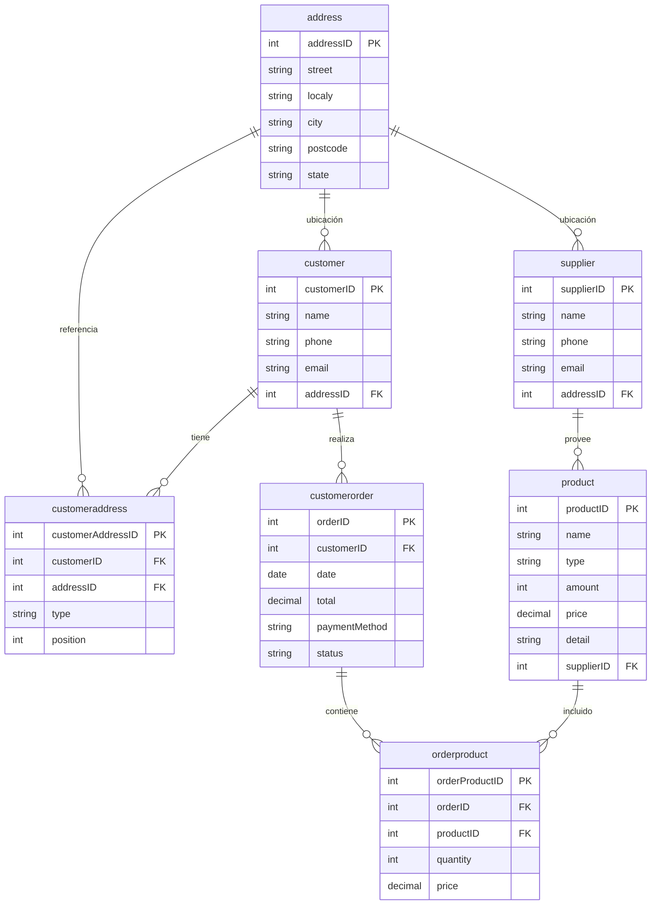
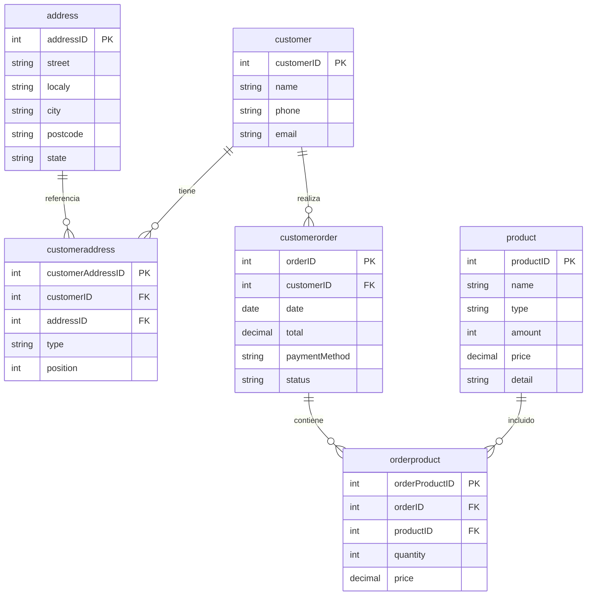
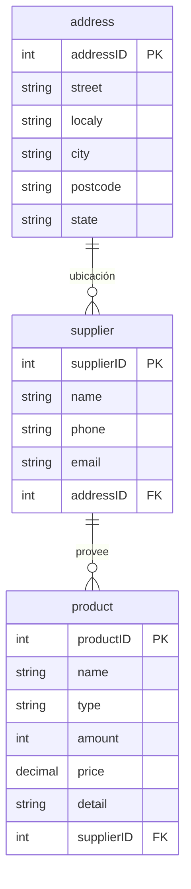

# Reporte de Práctica: Fragmentación Vertical de salesDB

## Universidad Autónoma del Estado de Hidalgo
### Base de Datos Distribuidas

---

> **NOTA IMPORTANTE**: Esta práctica utiliza los campos y estructura del archivo de backup real `salesBD_bk.sql`, no los campos teóricos descritos en el archivo exercise7 del profesor. Se identificaron y corrigieron discrepancias e inconsistencias entre la guía teórica y el backup real para garantizar que la fragmentación funcione correctamente con los datos reales.
>
> Principales diferencias corregidas:
> - Campo `name` (único) en lugar de `firstName`/`lastName`
> - Campo `detail` en lugar de `description`
> - Campo `amount` en lugar de `stock`
> - Campo `date` en lugar de `orderDate`
> - Campo `total` en lugar de `totalAmount`

---

## 1. Objetivo

Implementar una fragmentación vertical de la base de datos `salesDB` en dos fragmentos:
- **customerDB**: Datos relacionados con clientes y órdenes
- **supplierDB**: Datos relacionados con proveedores y productos

---

## 2. Modelo Relacional Original



---

## 3. Corrección de Inconsistencias

### 3.1 Identificación del Problema

El archivo guía `fragmentacion_final.sql` contenía inconsistencias respecto al backup real:

| Campo en Guía | Campo Real en Backup | Corrección Aplicada |
|---------------|---------------------|---------------------|
| `firstName`, `lastName` | `name` | Usar campo único `name` |
| `orderDate` | `date` | Usar campo `date` |
| `totalAmount` | `total` | Usar campo `total` |
| `stock` | `amount` | Usar campo `amount` |
| `description` | `detail` | Usar campo `detail` |

### 3.2 Estructura Real de la Base de Datos

```sql
-- Tabla customer en backup
CREATE TABLE customer (
    customerID INT(11) NOT NULL AUTO_INCREMENT,
    name VARCHAR(100) DEFAULT NULL,        -- Campo único, no first/last
    phone VARCHAR(20) DEFAULT NULL,
    email VARCHAR(100) DEFAULT NULL,
    addressID INT(11) DEFAULT NULL,        -- FK a address
    PRIMARY KEY (customerID)
) ENGINE=InnoDB;

-- Tabla product en backup
CREATE TABLE product (
    productID INT(11) NOT NULL AUTO_INCREMENT,
    name VARCHAR(100) DEFAULT NULL,
    type VARCHAR(50) DEFAULT NULL,
    amount INT(11) DEFAULT NULL,           -- No 'stock'
    price DECIMAL(10,2) DEFAULT NULL,
    detail TEXT,                           -- No 'description'
    supplierID INT(11) DEFAULT NULL,       -- FK a supplier
    PRIMARY KEY (productID)
) ENGINE=InnoDB;
```

---

## 4. Scripts de Fragmentación Vertical

### 4.1 Paso 1: Restaurar Base de Datos Original

```sql
-- Eliminar base de datos si existe
DROP DATABASE IF EXISTS salesDB;

-- Crear base de datos
CREATE DATABASE salesDB CHARACTER SET utf8 COLLATE utf8_general_ci;

-- Restaurar desde backup
-- mysql -u root -p salesDB < salesBD_bk.sql
```

### 4.2 Paso 2: Crear Fragmento customerDB

```sql
-- Crear base de datos del fragmento
DROP DATABASE IF EXISTS customerDB;
CREATE DATABASE customerDB CHARACTER SET utf8 COLLATE utf8_general_ci;
USE customerDB;

-- Tabla address (completa - requerida por FK)
CREATE TABLE address (
    addressID INT(11) NOT NULL AUTO_INCREMENT,
    street VARCHAR(100) DEFAULT NULL,
    localy VARCHAR(50) DEFAULT NULL,
    city VARCHAR(50) DEFAULT NULL,
    postcode VARCHAR(10) DEFAULT NULL,
    state VARCHAR(50) DEFAULT NULL,
    PRIMARY KEY (addressID)
) ENGINE=InnoDB DEFAULT CHARSET=utf8;

-- Tabla customer (FRAGMENTO VERTICAL - sin addressID)
CREATE TABLE customer (
    customerID INT(11) NOT NULL AUTO_INCREMENT,
    name VARCHAR(100) DEFAULT NULL,
    phone VARCHAR(20) DEFAULT NULL,
    email VARCHAR(100) DEFAULT NULL,
    PRIMARY KEY (customerID)
) ENGINE=InnoDB DEFAULT CHARSET=utf8;

-- Tabla customeraddress (completa)
CREATE TABLE customeraddress (
    customerAddressID INT(11) NOT NULL AUTO_INCREMENT,
    customerID INT(11) DEFAULT NULL,
    addressID INT(11) DEFAULT NULL,
    type VARCHAR(50) DEFAULT NULL,
    position INT(11) DEFAULT NULL,
    PRIMARY KEY (customerAddressID),
    FOREIGN KEY (customerID) REFERENCES customer (customerID),
    FOREIGN KEY (addressID) REFERENCES address (addressID)
) ENGINE=InnoDB DEFAULT CHARSET=utf8;

-- Tabla customerorder (completa)
CREATE TABLE customerorder (
    orderID INT(11) NOT NULL AUTO_INCREMENT,
    customerID INT(11) DEFAULT NULL,
    date DATE DEFAULT NULL,
    total DECIMAL(10,2) DEFAULT NULL,
    paymentMethod VARCHAR(50) DEFAULT NULL,
    status VARCHAR(50) DEFAULT NULL,
    PRIMARY KEY (orderID),
    FOREIGN KEY (customerID) REFERENCES customer (customerID)
) ENGINE=InnoDB DEFAULT CHARSET=utf8;

-- Tabla orderproduct (completa)
CREATE TABLE orderproduct (
    orderProductID INT(11) NOT NULL AUTO_INCREMENT,
    orderID INT(11) DEFAULT NULL,
    productID INT(11) DEFAULT NULL,
    quantity INT(11) DEFAULT NULL,
    price DECIMAL(10,2) DEFAULT NULL,
    PRIMARY KEY (orderProductID),
    FOREIGN KEY (orderID) REFERENCES customerorder (orderID)
) ENGINE=InnoDB DEFAULT CHARSET=utf8;

-- Tabla product (FRAGMENTO VERTICAL - sin supplierID)
CREATE TABLE product (
    productID INT(11) NOT NULL AUTO_INCREMENT,
    name VARCHAR(100) DEFAULT NULL,
    type VARCHAR(50) DEFAULT NULL,
    amount INT(11) DEFAULT NULL,
    price DECIMAL(10,2) DEFAULT NULL,
    detail TEXT,
    PRIMARY KEY (productID)
) ENGINE=InnoDB DEFAULT CHARSET=utf8;
```

### 4.3 Paso 3: Crear Fragmento supplierDB

```sql
-- Crear base de datos del fragmento
DROP DATABASE IF EXISTS supplierDB;
CREATE DATABASE supplierDB CHARACTER SET utf8 COLLATE utf8_general_ci;
USE supplierDB;

-- Tabla address (completa)
CREATE TABLE address (
    addressID INT(11) NOT NULL AUTO_INCREMENT,
    street VARCHAR(100) DEFAULT NULL,
    localy VARCHAR(50) DEFAULT NULL,
    city VARCHAR(50) DEFAULT NULL,
    postcode VARCHAR(10) DEFAULT NULL,
    state VARCHAR(50) DEFAULT NULL,
    PRIMARY KEY (addressID)
) ENGINE=InnoDB DEFAULT CHARSET=utf8;

-- Tabla supplier (completa)
CREATE TABLE supplier (
    supplierID INT(11) NOT NULL AUTO_INCREMENT,
    name VARCHAR(100) DEFAULT NULL,
    phone VARCHAR(20) DEFAULT NULL,
    email VARCHAR(100) DEFAULT NULL,
    addressID INT(11) DEFAULT NULL,
    PRIMARY KEY (supplierID),
    FOREIGN KEY (addressID) REFERENCES address (addressID)
) ENGINE=InnoDB DEFAULT CHARSET=utf8;

-- Tabla product (completa con FK a supplier)
CREATE TABLE product (
    productID INT(11) NOT NULL AUTO_INCREMENT,
    name VARCHAR(100) DEFAULT NULL,
    type VARCHAR(50) DEFAULT NULL,
    amount INT(11) DEFAULT NULL,
    price DECIMAL(10,2) DEFAULT NULL,
    detail TEXT,
    supplierID INT(11) DEFAULT NULL,
    PRIMARY KEY (productID),
    FOREIGN KEY (supplierID) REFERENCES supplier (supplierID)
) ENGINE=InnoDB DEFAULT CHARSET=utf8;
```

### 4.4 Paso 4: Cargar Datos a customerDB

```sql
-- Copiar datos a customerDB
INSERT INTO customerDB.address SELECT * FROM salesDB.address;

-- Fragmento vertical: customer sin addressID
INSERT INTO customerDB.customer (customerID, name, phone, email) 
SELECT customerID, name, phone, email FROM salesDB.customer;

-- Tablas completas
INSERT INTO customerDB.customeraddress SELECT * FROM salesDB.customeraddress;
INSERT INTO customerDB.customerorder SELECT * FROM salesDB.customerorder;
INSERT INTO customerDB.orderproduct SELECT * FROM salesDB.orderproduct;

-- Fragmento vertical: product sin supplierID
INSERT INTO customerDB.product (productID, name, type, amount, price, detail)
SELECT productID, name, type, amount, price, detail FROM salesDB.product;
```

### 4.5 Paso 5: Cargar Datos a supplierDB

```sql
-- Copiar datos a supplierDB
INSERT INTO supplierDB.address SELECT * FROM salesDB.address;
INSERT INTO supplierDB.supplier SELECT * FROM salesDB.supplier;

-- Product completo con supplierID
INSERT INTO supplierDB.product SELECT * FROM salesDB.product;
```

---

## 5. Modelos Relacionales de los Fragmentos

### 5.1 Fragmento customerDB



---

### 5.2 Fragmento supplierDB



---

## 6. Estadísticas de Fragmentación

### 6.1 Base de Datos Original (salesDB)

| Tabla | Registros |
|-------|-----------|
| address | 100 |
| customer | 100 |
| customeraddress | 110 |
| customerorder | 101 |
| orderproduct | 100 |
| product | 100 |
| supplier | 100 |

### 6.2 Fragmento customerDB

| Tabla | Registros | Tipo de Fragmento |
|-------|-----------|-------------------|
| address | 100 | Completa |
| customer | 100 | **Vertical** (sin addressID) |
| customeraddress | 110 | Completa |
| customerorder | 101 | Completa |
| orderproduct | 100 | Completa |
| product | 100 | **Vertical** (sin supplierID) |

### 6.3 Fragmento supplierDB

| Tabla | Registros | Tipo de Fragmento |
|-------|-----------|-------------------|
| address | 100 | Completa |
| supplier | 100 | Completa |
| product | 100 | Completa (con FK a supplier) |

### 6.4 Distribución Visual

```
Base Original (salesDB)
├── address (100)
├── customer (100)
├── customeraddress (110)
├── customerorder (101)
├── orderproduct (100)
├── product (100)
└── supplier (100)

Fragmentación Vertical:

┌──────────────────────────────┐      ┌──────────────────────────────┐
│        customerDB            │      │        supplierDB            │
├──────────────────────────────┤      ├──────────────────────────────┤
│ address (100) - Completa     │      │ address (100) - Completa     │
│ customer (100) - Sin addrID  │      │ supplier (100) - Completa    │
│ customeraddress (110)        │      │ product (100) - Con FK       │
│ customerorder (101)          │      └──────────────────────────────┘
│ orderproduct (100)           │
│ product (100) - Sin suppID   │
└──────────────────────────────┘
```

---

## 7. Verificación de Integridad

| Base de Datos | Customers | Suppliers | Products |
|---------------|-----------|-----------|----------|
| salesDB | 100 | 100 | 100 |
| customerDB | 100 | - | 100 |
| supplierDB | - | 100 | 100 |

---

## 8. Conclusiones

1. **Fragmentación exitosa**: La base de datos `salesDB` se fragmentó verticalmente en dos bases independientes.

2. **Corrección de inconsistencias**: Se adaptaron los scripts a la estructura real del backup (name vs first/last, date vs orderDate, etc.).

3. **Integridad referencial**: Se mantuvieron las claves foráneas necesarias en cada fragmento.

4. **Distribución equilibrada**: customerDB contiene las tablas relacionadas con clientes y órdenes; supplierDB contiene proveedores y productos.

---

*Práctica realizada el 21 de marzo de 2026*
